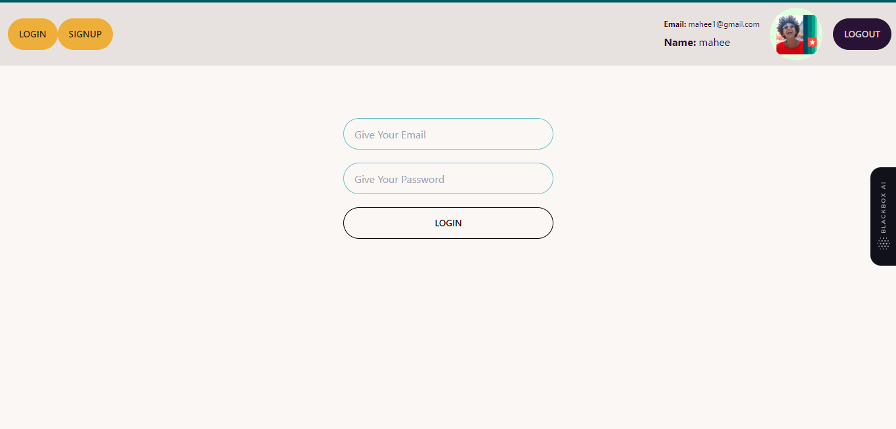

## Firebase Login & SignUp

 <!-- Replace "project-preview.png" with an actual preview image if available -->

This is a professional-grade web application that demonstrates the implementation of user authentication using Firebase. Users can sign up and log in securely to access the application's features.

### Live Demo

Check out the live demo of the application [here](https://dapper-elf-fe7479.netlify.app/).

### Technologies Used

- React
- Tailwind CSS
- React Router Dom

### Features

- User registration and authentication using Firebase
- Secure password hashing and storage
- Responsive and user-friendly interface
- Smooth navigation with React Router Dom

### How to Run the Project Locally

1. Clone the repository:

```bash
git clone https://github.com/maheefaisal/Firebase--Login--SignUp.git
```

2. Install the dependencies:

```bash
cd Firebase--Login--SignUp
npm install
```

3. Start the development server:

```bash
npm start
```


### Getting Help

If you encounter any issues or have questions regarding the project, please open an issue in the [GitHub repository](https://github.com/maheefaisal/Firebase--Login--SignUp/issues).

### Contribution

Contributions are welcome! If you'd like to improve the project or add new features, feel free to create a pull request.

### License

This project is licensed under the [MIT License](LICENSE).

---

By [Ehfaz Mahee](https://github.com/maheefaisal) <!-- Replace "Ehfaz Mahee" and "https://github.com/maheefaisal" with your actual name and GitHub profile link -->